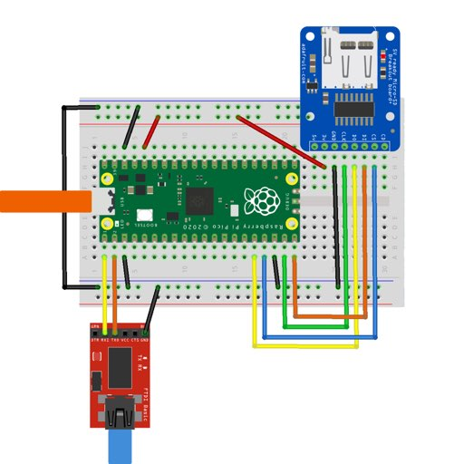

# The Raspberry Pi Pico port

## Introduction

The Raspberry Pi Pico is a very small and very cheap microcontroller board based
around the Raspberry Pi Foundation's RP2040 chip. It's got two Cortex-M0+ cores,
2MB of onboard NAND flash which can be used for code via a demand-paging system,
and 264kB of RAM.

The Fuzix port runs in cooperative multitasking mode with the root filesystem on
NAND, and with an optional SD card on the second SPI interface for anything
else. It supports both console over UART and it'll also pretend to be a USB
serial device. There's enough memory to run four or five processes at once, and
you can enable swapping to the SD card for up to 15.

## Configuration

Out of the box:

- /dev/hda is the NAND flash, containing the root filesystem. It can be
  partitioned but there's no real point, so it isn't.

- /dev/hdb is the SD card. Fuzix understands DOS partition tables. It's not hot
  swappable as the SD card is only probed at boot time.

If you have an SD card reader, connect the SD card to the following pins:

        Pico pin     RP2040 pin    SD card pin
        --------------------------------------
           16           12            MISO
           17           13             CS
           19           14            SCK
           20           15            MOSI

Remember to also connect the SD card's GND to any Raspberry Pico GND pin and Vcc
to 3.3V. Not 5V, or it won't work.



The console is accessible either via UART0 (at 115200 baud) or by connecting the
Pico up via USB to a PC, at which point it'll present itself as a standard USB
CDC serial device.

**Note:** There's a small delay at startup if USB is connected to attempt to
print full boot startup. There's a chance that startup message will still be
missed. Either press return few times to get login prompt, or press `y` or `n`
in case `fsck` is trying to ask you to check filesystem on startup. You can also
try to increase `DEV_USB_INIT_TIMEOUT` if you're missing startup messages on
powerup.

By default FUZIX sets up 1 UART and 4 USB consoles. You can change it in
`config.h` (see NUM_DEV_TTY_USB).

At startup system will automatically choose USB as boot console if it's
connected, otherwise boot will print on UART0.

You can force certain configuration by passwing boot command line. For example:
`tty=usb1,uart0,usb0`

## Building and installation

### Prerequisites

The following utils need to be installed:

- arm-none-eabi-gcc
- arm-none-eabi-binutils
- arm-none-eabi-gcc-newlib
- make
- cmake
- git

### Building

You do not need to install the [Raspberry Pi Pico
SDK](https://www.raspberrypi.org/documentation/pico/getting-started/), up to
date version will be pulled automatically from git.

To build Pico and Pico W image, run: `make TARGET=rpipico SUBTARGET=pico_w
diskimage` To build Pico 2 and Pico 2 W, run: `make TARGET=rpipico
SUBTARGET=pico2 diskimage`

Go to `Kernel/platform/platform-rpipico`. You will see `build/fuzix.uf2` and
`filesystem.uf2`.

### Installing Kernel

- Push and hold the BOOTSEL button as you plug usb into your computer.
- Copy `build/fuzix.uf2` onto the storage device. After copying is done, Pico
  will restart into FUZIX.
- To update the kernel, repeat the same procedure.

### Installing filesystem onto flash

The Pico's built-in NAND flash is supported, appearing as `/dev/hda` insize
Fuzix (the SD card is on `/dev/hdb`).  It's mapped via the Dhara FTL library, so
you get proper wear levelling.  The FTL library requires empty flash sectors to
work efficiently; the Fuzix filesystem has trim support, so the FTL library gets
notified when sectors become free, but if the filesystem gets very full and
Dhara runs out it can get extremely slow as it constantly does garbage
collection.

To flash the image either:

- Follow the same steps as for the kernel using `filesystem.uf2` file.
- Using picotool
  - Connect a terminal to UART 0 on the Pico.
  - Copy `filesystem.ftl` to the board by executing `picotool load
    filesystem.ftl -t bin -o 0x10018000`.

### Installing filesystem onto SD card

If you want to use an SD card, note that only filesystems up to 32MB are
supported.

Filesystem image files are located in `FUZIX/Images/rpipico`.

Partition SD card on your computer using MBR partition scheme then create 32MB
partition. If using Linux or MacOS you can then copy `filesys.img` or
`filesys8.img` onto the SD card using `dd` command.

``` dd if=filesystem.img of=/dev/sdXn oflag=direct bs=8192 ```

The first thing you probably want to do is `stty erase '^?'` to make the DELETE
key in your terminal work properly. (Use the `levee` editor to add it to
`$HOME/.profile`.)

## Userland

The Pico Fuzix port runs generic Cortex M0 ELF pie binaries, which are
theoretically portable to other ARM or Cortex devices, but this hasn't been
tried yet. There's 64kB available for both code and data; the system call
interface uses `svc`.

The Pico's mask ROM contains many useful routines which can be used instead of
libgcc, which would reduce the binary size. This hasn't been done yet because it
would render the binaries non-portable.

There's a Forth interpreter as `fforth` (use capital letters) and some games are
in `/usr/games`.

## Swap

Out of the box, Fuzix runs in swapless mode. This gives enough memory to run
most normal programs (you can use `free` to see how much you have left). If you
want more, you can enable swapping to the SD card.

To do this, create a partition of up to 2048kB (4096 blocks) on the SD card.
Then use the `swapon` command to enable swap. You can see swap usage with
`free`.

```
# fdisk -l
                      START                  END
Device    Boot  Head Sector Cylinder   Head Sector Cylinder  Type  Sector count

/dev/hdb1        33      3        0     38      6        1    83          4096
/dev/hdb2        38      7        1     58      8       18    83         65536
# swapon /dev/hdb1 4096
# free
         total         used         free
Mem:       160           56          104
Swap:     2048            0         2048
# 
```

You can't turn swap off again.

You probably can swap to the NAND flash, but it's a terrible idea.

## Issues

There are many, the biggest of which are:

- CPU exceptions should be mapped to signals.

...and probably others.

## Postscript

dg@cowlark.com

